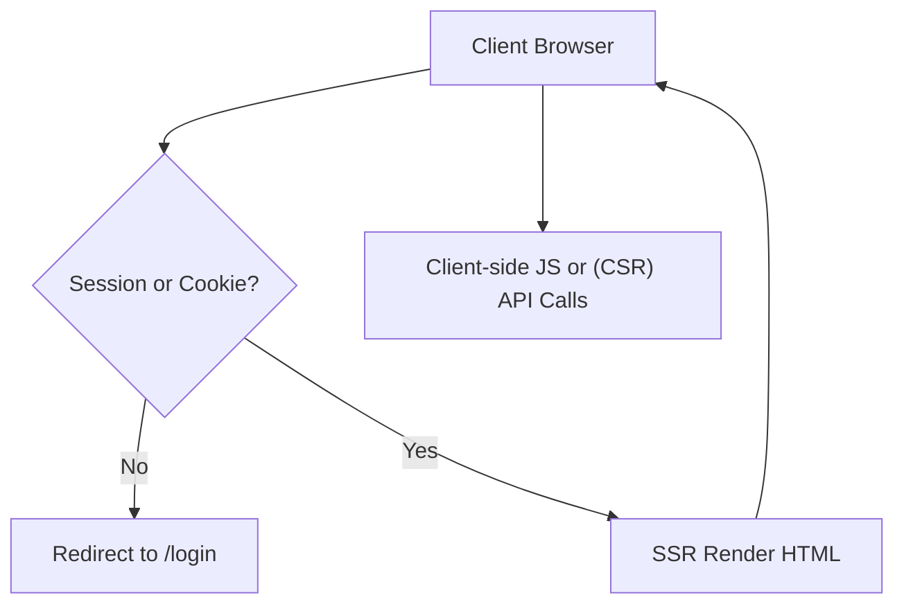
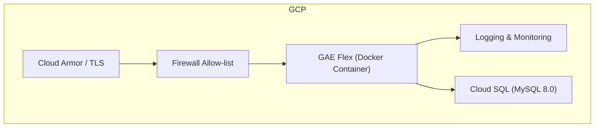

# 🚚 TWLKR 배송 실시간 관제 시스템 README&#x20;

> **계속 수정 중이며 본 공유 코드는 수정 개발 중에 있습니다. 25년 5월 중으로 서버 배포 시 url 공유 예정입니다.**

---

## 1. 프로젝트 개요 및 활용 아키텍처

### 1-1. 프로젝트 목적

- **실시간 배송 주문 관리**: ETA(예상 도착 시간) 기준으로 주문을 조회·제어합니다.
- **효율적 배차**: 기사 배정·상태 전이를 통합 제공합니다.
- **권한 구분**: 일반 사용자 **USER** / 관리자 **ADMIN** 두 역할로 기능을 분리합니다.

### 1-2. 기술 스택

| 레이어                | 사용 기술                                                  | 비고                       |
| ------------------ | ------------------------------------------------------ | ------------------------ |
| **Backend**        | Python 3.12 · FastAPI · Jinja2(SSR)                    | 단일 애플리케이션 컨테이너           |
| **Frontend**       | HTML + CSS · 모듈형 JavaScript(전역 네임스페이스 최소화)             | CSR 인터랙션 모듈화             |
| **Database**       | MySQL 8.0(스키마: `init-db.sql`) · Cloud SQL              | Private IP · IAM DB Auth |
| **Infrastructure** | Docker → Google App Engine Flexible(`runtime: custom`) | Cloud Armor / Firewall   |

### 1-3. 요청 흐름 (로그인 → SSR → CSR)

---

## 2. 배포 아키텍처 및 보안 사항

### 2-1. 인프라 개요

### 2-2. 애플리케이션 보안

| 영역                   | 조치 사항                                                                     |
| -------------------- | ------------------------------------------------------------------------- |
| **GAE Flex**         | Cloud Armor / Firewall, HSTS, `X-Content-Type-Options`, `X-Frame-Options` |
| **CORS**             | 최소 허용 도메인 화이트리스트만 허용                                                      |
| **Sessions**         | 서버-사이드 세션, `HttpOnly`+`Secure` 쿠키, 만료 시 자동 로그아웃                           |
| **Cloud SQL**        | Private IP, SSL/TLS, IAM DB Auth, 자동 백업, 최소 권한 파라미터                       |
| **Input Validation** | 서버 핵심 검증 + 클라이언트 보조 검증, SQL 인젝션·XSS 방지                                    |
| **Logging**          | PII 저장 금지, `{success, error_code, message}` 단일 JSON 스키마                   |

### 2-3. 배포 파이프라인

1. 단일 **Dockerfile** 빌드 → GAE Flex `gcloud app deploy`.
2. 환경 변수로 비밀·구성 관리.
3. Cloud SQL 연결은 **Cloud SQL Auth Proxy**를 로컬 개발 시 사용.

---

## 3. 주요 기능 (User Perspective)

### 3-1. Dashboard

- 실시간 주문 목록(ETA 기준) 조회
- 상태·부서·창고 필터링 및 검색
- 행 클릭으로 주문 상세 모달 표시
- (권한 및 잠금에 따라) 주문 정보 등록·편집·삭제

### 3-2. 주문 관리

- 신규 주문 등록
- 상태 전이: 대기 → 진행 → 완료 / 이슈 / 취소
- 기사 배정·수정
- 행 배경색으로 상태 시각화

### 3-3. 인수인계

- 공지(관리자)와 인수인계 내역(사용자) 확인
- 본인 작성 인수인계 항목 수정 가능

### 3-4. 사용자 관리 (ADMIN)

- 사용자 계정 생성·삭제
- 권한·부서 설정

### 3-5. 알림 시스템

- 성공, 오류, 경고, 정보 알림
- 우상단 5초간 표시(중요도에 따라 수동 종료)
- 중복 알림 방지, 명확한 메시지 제공

### 3-6. 반응형 UI & 접근성

- 화면 크기에 따른 자동 레이아웃 조정
- 키보드 내비게이션 지원
- 고대비 모드(예정)

### 3-7. 동시 편집 보호

- 다른 사용자가 편집 중인 항목은 잠금 알림 표시
- 잠금 해제 후 편집 가능

---

## 4. 참고 자료 및 향후 작업

- **init-db.sql** : DB 스키마 정의서.
- **docs/**      : API 스펙, UI 목업 예정.
- 향후: 테스트 시나리오·성능 지표·CI/CD 흐름 문서화 예정.

---

> 문의·제안은 Issues 탭을 통해 남겨 주세요.

