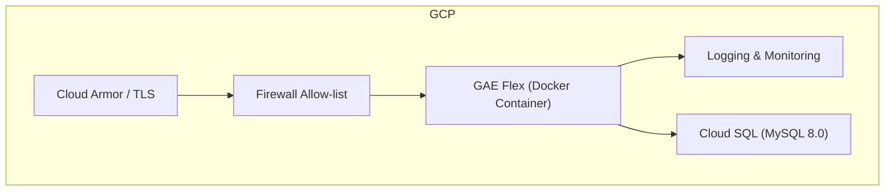

<<<<<<< HEAD

# 🚚 TWLKR Real-Time Delivery Control System — README

=======
# 🚚 TWLKR Real-Time Delivery Control System — README

>>>>>>> origin/main
> **This repository is under active development. The production URL will be shared after the server is deployed in May 2025.**

---

## 1. Project Overview & Architecture

### 1‑1. Purpose

- **Real‑time order management** — query and control delivery orders based on ETA (Estimated Time of Arrival).
- **Efficient dispatch** — unified interface for assigning couriers and updating delivery states.
- **Role‑based access** — separate feature sets for **USER** and **ADMIN** accounts.

### 1‑2. Technology Stack

| Layer            | Technologies                                           | Notes                                |
| ---------------- | ------------------------------------------------------ | ------------------------------------ |
| **Backend**      | Python 3.12 · FastAPI · Jinja2 (SSR)                   | Single application container         |
| **Frontend**     | HTML + CSS · Modular JavaScript (minimal global scope) | CSR interaction modules              |
| **Database**     | MySQL 8.0 (`init-db.sql`) · Cloud SQL                  | Private IP · IAM DB Auth             |
| **Infrastructure** | Docker → Google App Engine Flexible (`runtime: custom`) | Cloud Armor · Firewall               |

### 1‑3. Request Flow (Login → SSR → CSR)

---

## 2. Deployment Architecture & Security

### 2‑1. Infrastructure Overview

### 2‑2. Application Security Controls

| Area                | Measures                                                                                   |
| ------------------- | ------------------------------------------------------------------------------------------- |
| **GAE Flex**        | Cloud Armor · Firewall, HSTS, `X-Content-Type-Options`, `X-Frame-Options`                   |
| **CORS**            | Allow‑list only the minimum required domains                                                |
| **Sessions**        | Server‑side sessions, `HttpOnly` + `Secure` cookies, automatic logout on expiration         |
| **Cloud SQL**       | Private IP, SSL/TLS, IAM DB Auth, automated backups, least‑privilege parameters             |
| **Input Validation**| Central server‑side validation with client‑side assistance; protection against SQLi and XSS |
| **Logging**         | No PII stored; unified JSON schema `{success, error_code, message}`                         |

### 2‑3. Deployment Pipeline
<<<<<<< HEAD
=======

1. Build a single **Dockerfile** and deploy with `gcloud app deploy` (GAE Flex).
2. Manage secrets and configuration through environment variables.
3. For local development, connect to Cloud SQL via **Cloud SQL Auth Proxy**.

---

## 3. Key Features (User Perspective)

### 3‑1. Dashboard

- **Real‑time delivery order list**
  

- **Create new delivery orders**
  

- **Assign couriers and update delivery status (for dispatch operators)**
  
  

- **View detailed order information**
  

- **Basic data visualizations (e.g., order volumes, courier workload)**
  

---

> For questions or suggestions, please open an issue in the **Issues** tab.
>>>>>>> origin/main

1. Build a single **Dockerfile** and deploy with `gcloud app deploy` (GAE Flex).
2. Manage secrets and configuration through environment variables.
3. For local development, connect to Cloud SQL via **Cloud SQL Auth Proxy**.
